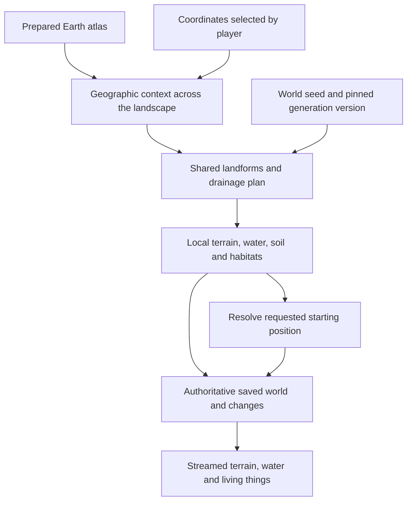

# World generation from a chosen place

**Status:** research and design proposal, 2026-09-13. Author: Codex. No implementation is opened by this document.

The owner's direction in the world-generation discussion is to generate country that roughly resembles its real
region, and eventually let the player choose a starting location anywhere on Earth. The recommendations below
are proposals. [CANON.md](CANON.md) remains the record of ratified decisions; this document does not change it,
the current beta scope, or [ARCHITECTURE.md](ARCHITECTURE.md).

## 1. Recommendation

Build a **prepared Earth atlas** that can answer geographic questions at any coordinate, and a **landscape
generator** that turns those answers into coherent local country. The start selection chooses where a player
enters this world. It does not choose which world-generation rules the entire world uses.

The atlas should preserve broad geography, environmental conditions and regional identity. Generation should
invent local terrain within those constraints. Water, soil, plants, animals and materials must agree with the
generated terrain. A seed varies the local arrangement; it does not turn one ecological region into another.

There is enough published information to investigate a global foundation without hand-authoring every place.
There is not a complete ready-made description of pre-human Earth. Geological detail, ecological communities,
small water sources, extinct fauna and the removal of human effects remain substantial research work.

Recommended first candidates are ETOPO for broad relief, CHELSA climatologies for climate, RESOLVE 2017 for
ecological geography, GLiM for coarse lithology, and SoilGrids as supporting soil evidence. Hydrological products
are useful candidates but need the distribution review in §3 before becoming a dependency. These selections
are provisional: this pass read documentation, not dataset pixels or archives.

## 2. What happens after a player chooses a location

The atlas is prepared during development, outside the game. Runtime lookup reads installed data; neither an LLM
nor an internet mapping service decides what a coordinate contains. A complete coarse atlas can accompany the
game, with regional refinements packaged separately if measurements justify that. Exploring an installed area
does not inherently require a download. This qualifies the runtime-fetch assumption in the handoff brief.

### A lookup is more than a biome label

For a raster, transform latitude/longitude into that source's coordinate system and grid coordinates, then
sample its values. For polygon data, use a spatial index to find the containing or overlapping features. Keep
source identity, units, resolution, uncertainty and missing-data status with each result.

Continuous values and categorical values need different treatment. Interpolate suitable continuous fields
without blending through missing ocean cells. Do not interpolate rock or species IDs as numbers. At a boundary,
retain the competing geological units or ecological candidates and their context; use physical conditions to
resolve the local result. Administrative borders play no role in ecology.

Lookups must cover the whole generated area, with surrounding context at multiple scales. A coast requires the
neighbouring sea; a valley requires its enclosing ridges; a river requires its upstream basin. One sample at the
spawn cannot provide any of those. The source's own map projection, pixel registration, longitude convention,
vertical datum and scale/offset must be explicit. A nominal angular resolution is not a fixed number of metres
at every latitude, and resampling does not increase the information in the source.

The conceptual result contains:

| Field group | What it contributes |
|---|---|
| Place | Canonical Earth position; land, water or ice; geographic feature identifiers |
| Broad shape | Elevation envelope, regional relief, slope statistics, dominant ridge/valley direction, coast context |
| Materials | Lithological units, surface deposits, supported mineral-deposit models, evidence confidence |
| Climate | Monthly conditions, reference elevation, baseline period, counterfactual adjustments |
| Water | Basin membership, external inflows/outlets, lake type, expected seasonal water availability |
| Ecology | Biogeographic realm, ecoregion candidates, researched species pool and habitat requirements |
| Evidence | Dataset/version, resolution, transformations, uncertainty, missing fields and fallback provenance |

This is a proposed information boundary, not a committed file format or an assertion that every source supplies
every field. For example, a lithology map does not supply ore grade, and monthly precipitation does not supply a
stream's flow on the morning of the spawn.

## 3. Geographic inputs: candidates and limitations

Primary provider documentation and research pages were checked on 2026-09-13. File sizes below are advertised
downloads, where available; they are not measured installed size or memory use. No dataset archives were
downloaded. Licence statements concern the exact named products, not every product offered by their publisher.

| Input / candidate | Coverage and detail | Proposed use; important limits | Access, size and distribution position |
|---|---|---|---|
| **Natural Earth physical layers** | Global cartographic layers at 1:10 million, 1:50 million and 1:110 million map scales. These are map scales, not metre resolutions. | Location-selection map and broad visual context. Too generalized to determine a walkable beach, narrow island or lake shore. Do not mix its generalized coastline into authoritative local terrain independently. | Public domain. Provider lists 576 MB for all vector themes as SHP; that includes themes we would not need. [Downloads](https://www.naturalearthdata.com/downloads/), [terms](https://www.naturalearthdata.com/about/terms-of-use/). |
| **NOAA ETOPO 2022** | Global land elevation and ocean bathymetry at 15 arc-seconds, with 30- and 60-arc-second products; ice-surface and bedrock alternatives. | Broad relief, continental shelf and ice context. Its spacing does not resolve small streams or individual slopes underfoot. Choose surface versus bedrock deliberately; do not replace an ice sheet with exposed land. | NOAA metadata lists CC0. Tiled GeoTIFF/NetCDF; total selected download size not established. Retain source identifiers where available. [Product](https://www.ncei.noaa.gov/products/etopo-global-relief-model), [metadata and terms](https://www.ncei.noaa.gov/access/metadata/landing-page/bin/iso?id=gov.noaa.ngdc.mgg.dem%3Aetopo_2022). |
| **CHELSA climatologies v2.1** | Global kilometre-scale climatologies; historical baseline 1981–2010 and other periods/products. Monthly temperature, precipitation and further environmental variables. | Preferred climate candidate. Select historical fields explicitly, then apply the game's baseline policy. Mountain downscaling is useful evidence but already incorporates real relief; local adjustments must avoid counting terrain effects twice. | Current dataset page lists **CC0 1.0**, COG format. Model code has a separate licence; do not confuse code and data terms. Archive size and exact selected files still to inventory. [Dataset](https://www.chelsa-climate.org/datasets/chelsa_climatologies), [model mechanism](https://www.chelsa-climate.org/models/chelsa). |
| **WorldClim 2.1** | Global land climate surfaces for 1970–2000; monthly fields at 30 arc-seconds through 10 arc-minutes. | Comparison candidate, not the proposed shipped baseline. A historical modern climatology is not automatically pre-human climate. | Published terms allow non-commercial use but require prior permission for commercial use **or redistribution**. Exclude from the distributable atlas unless permission is obtained. Selected archive size not inventoried. [Data](https://www.worldclim.org/data/worldclim21.html), [terms](https://www.worldclim.org/about.html). |
| **GLiM v1.0, verified PANGAEA release** | Global lithology. The linked release is a **0.5-degree grid**, despite its abstract describing the underlying detailed polygon compilation. | Broad rock-family constraints. This release cannot locate an individual outcrop or geological contact. Detailed polygon access, terms and regional replacements remain unresolved. | Linked gridded release: CC BY 3.0, listed size 37.8 kB. Do not mistake that size for the detailed polygon database. [Exact release](https://doi.pangaea.de/10.1594/PANGAEA.788537), [research paper](https://doi.org/10.1029/2012GC004370). |
| **HydroBASINS v1 and HydroRIVERS v1** | Nested basins and connected river reaches derived from 15-arc-second HydroSHEDS. Basins exclude Antarctica. River selection includes catchments ≥10 km² or mean flow ≥0.1 m³/s. | Strong candidates for shared basin structure, upstream connections and major river corridors. Small creeks are not complete. Northern coverage inherits coarser source data above 60°N. Modern mean flow is evidence, not a naturalized seasonal simulation. | HydroRIVERS lists 544 MB global SHP; HydroBASINS offers continental downloads. Both advertise commercial use under the HydroSHEDS-specific agreement. It has substantive distribution conditions, discussed below. [Basins](https://www.hydrosheds.org/products/hydrobasins), [rivers](https://www.hydrosheds.org/products/hydrorivers), [core coverage](https://www.hydrosheds.org/products/hydrosheds). |
| **HydroLAKES v1** | Global lake polygons targeting lakes ≥10 hectares, linked to river and basin IDs; includes reservoirs. Depth and volume attributes include estimates. | Major lake context. Small ponds are missing; natural lakes and reservoirs must be distinguished. A mean depth cannot specify a playable lake bed. | CC BY 4.0. Polygon downloads listed as 820 MB SHP or 763 MB geodatabase. [Provider and terms](https://www.hydrosheds.org/products/hydrolakes). |
| **RESOLVE Ecoregions 2017** | Terrestrial ecological regions, with biome and realm attributes; not a local plant-placement map. | Select the geographic pool of possible communities. Ignore modern conservation-status fields as generation targets. It does not provide freshwater/marine ecology or a complete species catalogue. | CC BY 4.0; official map lists 150 MB zipped shapefile. Distinguish this from newer One Earth products with different terms. [Provider download page](https://ecoregions.world/), [hosted schema](https://developers.google.com/earth-engine/datasets/catalog/RESOLVE_ECOREGIONS_2017). |
| **SoilGrids** | Global predicted soil properties at 250 m, with six depth intervals and uncertainty information. | Supporting evidence for texture and other properties; not a literal map of pre-human soil or the complete depth to bedrock. Documented masks include urban, water, glacier and bare-surface classes; investigate missing areas before claiming coverage. | CC BY 4.0. Use selected properties, depths and quantiles rather than the full collection; total selected size unmeasured. [Overview](https://isric.org/explore/soilgrids), [layer/mask documentation](https://docs.isric.org/globaldata/soilgrids/SoilGrids_faqs_01.html), [access and licence](https://docs.isric.org/globaldata/soilgrids/SoilGrids_faqs_02.html). |
| **GBIF and regional floras/faunal surveys** | Occurrence records and other biodiversity datasets with uneven coverage and precision. | Research and independent evidence for species pools and habitat associations. An occurrence is not abundance; an unrecorded species is not necessarily absent. Current ranges also reflect people and introductions. | GBIF supports CC0, CC BY and CC BY-NC datasets; filter at dataset level, preserve attribution and occurrence-download provenance. No global archive size assumed. [GBIF licence explanation](https://www.gbif.org/pt/news/82812/licensing-milestone-for-data-access-in-gbiforg), [dataset classes](https://techdocs.gbif.org/en/data-publishing/dataset-classes). |

### Distribution choices that need resolving

HydroSHEDS' linked v1.4 technical documentation, Appendix A, permits distribution incorporated in derivative
works subject to protective end-user/distributor terms and prohibits standalone distribution of the licensed
materials. It also states attribution and other obligations. This is not a CC-BY-only product. **Recommendation:
keep it a conditional candidate until the intended game/atlas packaging is checked against the actual agreement.**
Do not assume preprocessing removes these obligations. An alternative is to derive our own coarse drainage
network from permissive elevation data, with its own quality and development cost. [Agreement, Appendix A](https://data.hydrosheds.org/file/technical-documentation/HydroSHEDS_TechDoc_v1_4.pdf).

The One Earth Bioregions Framework page states CC BY-NC 4.0 for its shapefile. It should not be substituted for
RESOLVE 2017 merely because both describe ecological regions. [One Earth framework](https://www.oneearth.org/bioregions-2023/).

Before any acquisition, enumerate exact product versions, files, aggregate bytes, redistribution terms and
attributions. The handoff's download-permission rule still applies to acquiring datasets; reading documentation
for this authorized research has not installed any data. Notices are added when data or assets are actually
imported, not as a claim that this shortlist has already been licensed and vendored.

### Inputs this shortlist does not solve

* Subsurface structure, ore grade, deposit size, groundwater and accessible springs. Lithology is one input to
  geological deposit models; placing an ore wherever a rock family occurs would not be sufficient.
* Local vegetation structure, age, disturbance and species traits. Ecoregion boundaries are only the beginning.
* Ice, ocean and freshwater ecosystems at the same quality as terrestrial country.
* The landscape without human land use, dams, reclamation, introduced species or human-caused extinctions.
* Small islands, detailed shores and local features erased by a coarse global grid. They need feature-preserving
  overlays or better regional evidence, not an invented claim of precision.

## 4. The boundary between Earth data and generated detail

Use **constraints at several scales**, rather than one universal cutoff distance.

| Preserve across seeds, proposed | Vary within regional bounds, proposed | Derive after shaping the actual landscape |
|---|---|---|
| Continental identity, approximate major coasts, broad mountain belts and relief | Individual slopes, minor valleys, headlands, dune ridges and small lake shapes | Local drainage paths, slope, aspect and exposure |
| Major basin connections and selected significant geographic features | Tributary paths and local landform dimensions within the shared basin plan | Water availability, soil profile and habitat suitability |
| Broad climate and geological/biogeographic provinces | Outcrop exposure, habitat mosaics and local community structure | Individual plants, loose materials and animal habitat |

A feature can matter even below a dataset's resolution: a narrow peninsula must not disappear simply because
the global grid is coarse. Regional overlays should identify essential features and their permitted variation.
Numerical displacement limits and landform dimensions need regional evidence; none are asserted as measured here.

This policy also constrains climate reuse. If we move an entire mountain range but retain a detailed real-world
rainfall map, rainfall and mountains can disagree. Initially preserve the broad barriers supporting the climate
pattern, vary smaller landforms, and adjust climate only for the difference between source and generated relief.
More radical rearrangement would need a larger climate-generation model.

The proposed scale remains physical metres. Approximate topography does not require shrinking continents or
shortening all journeys. Named search results must distinguish the real geographic reference from the generated
local shore or ridge; the map shown before spawn should eventually reflect the actual seed where detail matters.

## 5. Generation sequence and agreement across boundaries

### Prepare evidence once

Normalize data through explicit adapters: coordinates, datum, units, masks, source resolution and version.
Resolve contradictory shore and water datasets into one authoritative land/water boundary. Preserve small
important features separately when a coarse raster cannot. Extract relief statistics and directional structure
from elevation rather than only interpolating a smooth height field. Establish coarse basin connectivity and
the baseline climate policy. Build spatial indexes and package data by stable geographic identity.

### Plan shared structures before local tiles

Create basin- or landform-scale plans with stable IDs, upstream contributions, outlets, ridge constraints and
river corridors. Fine streams may be generated, but they must join a shared drainage plan. Generate channel
profiles and surrounding valleys together. Lake beds, water levels, possible outlets and seasonal storage must
be mutually consistent. Closed basins are legitimate; every depression should not automatically be filled into
a river leading to the sea.

Drainage-network-based terrain synthesis is an established research direction. It is a candidate mechanism,
not a claim that an existing paper supplies all our ecology, dryland, lake or planetary requirements.
[Génevaux et al., 2013](https://doi.org/10.1145/2461912.2461996).

Do not equate catchment area with water availability. Rainfall, evaporation, infiltration, storage, snow/ice
where relevant, and upstream flow need to affect whether a channel is dry, intermittent or flowing. Preserve
salt/fresh distinctions, including saline inland lakes. We can generate a plausible initial state without
simulating geological history, then let the simulation evolve it under CANON ruling 22.

### Generate local country

Within the shared plan, use landform-specific mechanisms for dunes, river valleys, hillslopes, rocky coasts,
glacial terrain and other families. Noise may supply irregularity inside those mechanisms. A single noise
surface with different colours is insufficient. Bedrock properties and deposited material inform soil; climate,
soil, moisture, exposure, disturbance and geographic species pools inform plant communities. Animal habitat
follows from the resulting resources and environment.

Generate local material detail last, with coherent transport where relevant: loose stones can originate
upstream rather than matching only the bedrock immediately beneath them. A mineral deposit has position,
extent and material properties independent of whether the player has discovered it. Do not roll new ore when
the player digs, or place convenient materials to satisfy the starting scorer.

### Make exploration order irrelevant

Use canonical geographic feature/cell identities and separately derived seeds for terrain, plants and other
stages. Adding a vegetation rule should not consume a random number that moves a river. Shared border samples
have one owner. Local computations can read neighbouring context, but a finite border buffer cannot substitute
for a river's whole upstream catchment. Compute or load the shared plan first.

The world pins atlas, generator, species/material catalogue and reconstruction-policy versions, not just a seed.
An update must not produce a new cliff beside an old settlement. Keep old generation available for unexplored
areas of old worlds, or require an explicit migration policy. Regional refinement packages must likewise be
pinned; installing one cannot silently change an existing world halfway through exploration.

Server authority and the existing separation between generated layers and player changes remain useful.
Streamed near and distant views should derive from the same generated world. Any detail affecting collision,
drainage, resource access or construction must have an authoritative representation, not exist solely as client
decoration. Stable generated-object IDs must survive unloading so taking a resource does not regenerate it.

## 6. Reconstructing the world without humanity

Treat this as a documented transformation of evidence, not deletion of buildings from a satellite image.

1. **Climate:** apply the existing pre-human baseline direction from CANON. A modern historical normal remains
   anthropogenically affected. A regional correction approach needs worldwide evidence; do not apply one NSW
   temperature offset everywhere or assume it reconstructs precipitation and ice.
2. **Surface:** identify human-modified evidence. Reservoir removal can require rebuilding the underlying
   valley and reconnecting drainage. Modern mines, cuttings, reclaimed land and cultivated soils need similar
   attention. A missing urban soil pixel is unknown, not sterile ground or zero soil depth.
3. **Ecology:** combine native ranges, ecological associations, remnant communities and historical evidence.
   Infer plausible vegetation in cleared areas rather than reproducing fields. Do not simply extend the nearest
   modern forest over all open land.
4. **Extinct fauna and disturbance:** research region-specific ranges and plausible consequences of grazing,
   browsing and natural disturbance. This is not solved by adding a large-animal mesh to a modern ecosystem.

There is no single measured present-day Earth in which humanity never evolved. The design must name its
approximations and hold the consequences consistent. Start with contemporary broad geography plus explicit
naturalization rules; a particular palaeoclimate epoch is not silently substituted for the owner's premise.

## 7. Three contrasting design walkthroughs

These are **evidence-backed design exercises**, not results of coordinate sampling or generated-world tests.
Exact probe points and quantitative environmental values come from a later atlas extraction. Park names locate
the examples; contemporary park boundaries, infrastructure and cultural modifications are not game terrain.

### Bherwerre Peninsula: coastal country

**Evidence:** Parks Australia describes sedimentary bedrock, sand over the peninsula, exposed cliffs/platforms,
and lakes formed by sand blocking streams. [Booderee geology](https://booderee.gov.au/discover/nature/geology/).

**Lookup:** coastal shape and relief, sedimentary geology and surface sand, seasonal climate, regional flora,
freshwater basins and marine exposure. **Generate:** linked hard and soft shore sections; dunes with sheltered
and exposed sides; lakes with intentional beds and plausible sand barriers; soil/habitat transitions into the
region's communities. Existing [ECOSYSTEM.md](ECOSYSTEM.md) provides starting regional research.

**Seed freedom:** small shore shapes, dune ridges, local lake contours and stands. **Failure to catch:** a lake
with random terrain poking through it, or every sandy patch classified as a bare beach. **Knowledge transfer:**
the player can distinguish environments that offer different footing, water and first materials.

### Munga-Thirri–Simpson Desert: inland dry country

**Evidence:** South Australia's park authority describes parallel dune systems, playas, spinifex grasslands
and acacia woodlands. [Regional description](https://www.parks.sa.gov.au/parks/munga-thirri-simpson-desert-national-park).

**Lookup:** inland setting, sand/deposit evidence, dune orientation and relief statistics, climatic water deficit,
closed-basin context and desert species pool. **Generate:** connected dune fields and intervening low ground,
dry/episodically wet basins and habitat patches from available moisture. The source description does not supply
dune spacing, groundwater depth or a complete pre-human species list; those remain research tasks.

**Seed freedom:** individual dunes and vegetation patches within the regional pattern. **Failure to catch:**
the locally wettest hollow becoming a permanent swamp simply because it ranks highest in the tile. **Knowledge
transfer:** reading a possible drainage feature is useful, but the game does not guarantee surface water or
nearby wood merely because the player needs them.

### Sagarmatha / upper Dudh Kosi: high mountain country

**Evidence:** UNESCO identifies high mountains, glaciers, deep valleys and the upper Dudh Kosi catchment.
[Site account](https://whc.unesco.org/en/list/120).

**Lookup:** broad divides, large relief, valley/basin structure, ice and seasonal climate, altitude-dependent
habitat evidence and regional rock units. **Generate:** connected valleys, suitable glacial landforms, rocky
slopes and researched vegetation transitions. Keep broad barriers consistent with climate inputs; derive finer
aspect and elevation effects from the generated ground.

**Seed freedom:** subsidiary gullies, rock exposures and local vegetation arrangement. **Failure to catch:**
summits flattened by height encoding, a river stopping at a tile edge, or trees continuing into terrain their
climate cannot support. **Knowledge transfer:** elevation and exposure change travel and material availability.
The physiology needed to make high-altitude starts credible is a separate simulation dependency.

### Required coverage beyond these examples

Also probe tropical forest, boreal/Arctic country, wetlands/deltas, small islands, terrain below sea level,
antimeridian crossings, both poles, and open ocean. These are coverage tests, not a menu restricting the player
to approved starter regions. A data lookup may be globally defined before every environment is playable.

## 8. Starting position is a separate policy

Persist the requested coordinate, starting date/time and resolved position. Distinguish geographical selection
from minimal geometric placement: finding room for the body must not become a search for a better ecosystem.
No fallback to Bherwerre or the Southern Highlands when an input is unavailable. Report missing support clearly.

Exact-point versus neighbourhood selection, the maximum placement adjustment, starting season, and whether a
player may begin on open water or ice remain design choices. Recommendation: show the requested conditions and
any resolved adjustment before creation, permit difficult supported starts, and make any assisted resource-rich
start an explicit option. The present scorer can help describe a place; it should not override a location choice.

Eventually "anywhere" includes environments the beta cannot yet simulate. A temporary honest unsupported state
is preferable to relocating the player. Global lookup coverage, global terrain generation and global playable
simulation should be tracked separately.

## 9. Size and work: price the atlas separately from generated detail

An atlas need not contain a fully generated planet. Package coarse context and feature graphs; generate local
detail on demand and retain player changes. The global drainage structure can be prepared without storing
every tributary at walking resolution.

The following are **raw storage calculations**, not measured file sizes or proposed fidelity thresholds. Assume
a full rectangular longitude/latitude grid, no duplicated endpoint row/column, two bytes per sample, no masks,
compression, indexes or metadata. For spacing `s` arc-seconds:

`samples = (360 × 3600 / s) × (180 × 3600 / s)`

| Hypothetical stored data | Raw decimal size |
|---|---:|
| One band at 5 arc-minutes | 18.66 MB |
| Six monthly fields at 5 arc-minutes: 72 bands | 1.34 GB |
| One band at 60 arc-seconds | 466.56 MB |
| One band at 30 arc-seconds | 1.87 GB |
| Six monthly fields at 30 arc-seconds: 72 bands | 134.37 GB |
| One band at 15 arc-seconds | 7.46 GB |

This supports investigating a compact coarse base with selected finer packages, not promising an install size
now. Two-byte quantization needs a field-specific range/error analysis. Regional tiles, masks and compression
change the cost; so do source data types and download packaging. Processing can read tiles incrementally rather
than loading a full planet into memory. Measure actual archives, peak working memory and runtime query cost
before adopting a package layout.

The recurring work is building and validating landscape families, researching regional differences, expanding
species/material capabilities, and naturalizing the evidence. A coastal-dune mechanism can serve many regions,
but the species, climate, sediment and shape constraints remain local. Region refinements should override only
the facts they improve and cite their source; they should not duplicate entire independent recipes.

## 10. Fit with EarthGame2: inspected constraints

Code observations below were reviewed against main `179bf8d` on 2026-09-13 after the far forest landed:
protocol 8 and tile layers 6 and 7 derive the distant forest from `stand`. This proposal changes none of those
formats. Implementation must recheck the current contracts, because the beta continues alongside this work.

| Existing seam / evidence | Consequence for this design |
|---|---|
| [Region.cs](../Engine/packages/com.earthgame.engine/Runtime/World/Region.cs): `ById` recognizes Bherwerre; the class combines place, bounded extent and wake time. [WorldSave.cs](../Engine/packages/com.earthgame.server/Runtime/WorldSave.cs): loading can resolve this ID. | Separate world geography, generated areas and start selection. Saves must carry enough identity to load arbitrary supported starts. No unknown-place default. |
| [LocalFrame.cs](../Engine/packages/com.earthgame.engine/Runtime/World/LocalFrame.cs) uses a bounded small-angle map and rejects origins at absolute latitude ≥89°. [WorldPoint.cs](../Engine/packages/com.earthgame.engine/Runtime/World/WorldPoint.cs) already represents Earth-fixed double-precision positions. | Reuse the geographic concepts, but do not claim the current local frame tiles the planet. Design canonical global addressing, polar handling, local frame transitions and client recentering before seamless expansion. Arbitrary-start patches can be an intermediate proof, not the final boundary. |
| [TileCodec.cs](../Engine/packages/com.earthgame.engine/Runtime/World/TileCodec.cs): `MaxHeightM = 327`; main now refuses out-of-range heights and neighbour deltas rather than silently clamping/wrapping. | Mountains and deep ocean cannot use this representation unchanged. A future contract must resolve range/precision explicitly, such as wider values or tile elevation origins with checked residual ranges. The refusal protects existing formats; it does not extend them. |
| [WorldCreation.cs](../Engine/packages/com.earthgame.server/Runtime/WorldCreation.cs) takes a baked height raster, invokes `WorldLayers.Compute`, saves layers and chooses `WakeScorer.Best()`. | Useful authority/persistence seam. Introduce an atlas-fed generation path behind an explicit version, and make spawn resolution separate. Keep the existing beta path as a regression fixture. |
| [WorldLayers.cs](../Engine/packages/com.earthgame.engine/Runtime/World/WorldLayers.cs): `Stones` follows plant communities and cover; rock draws use topology and a province hash. [GeologyScale.cs](../Engine/packages/com.earthgame.engine/Runtime/World/GeologyScale.cs) carries a regional scale measured in the Southern Highlands. | The philosophical rock-to-ecology chain is not fully the implementation order. Atlas geology must influence terrain/soil upstream. A regional province measurement cannot become a global geological constant. |
| [SoilModel.cs](../Engine/packages/com.earthgame.engine/Runtime/World/SoilModel.cs) normalizes topographic wetness using the region's land percentiles. | Relative ridge/hollow wetness is useful but not absolute climatic water supply. Retain its useful mechanism while adding calibrated water availability; a desert's wettest cell is not necessarily wet. |
| [PlantSpecies.cs](../Engine/packages/com.earthgame.engine/Runtime/World/PlantSpecies.cs), [AnimalSpecies.cs](../Engine/packages/com.earthgame.engine/Runtime/World/AnimalSpecies.cs) and [WakeScorer.cs](../Engine/packages/com.earthgame.engine/Runtime/World/WakeScorer.cs) contain the regional catalogue and named fibre species. | A global catalogue and geographic candidate selection are required. Sharing traits and mechanisms need not mean giving every region the same species. |
| [Stand.cs](../Engine/packages/com.earthgame.engine/Runtime/World/Stand.cs): three bits for tall-plant identity; `BuildTall` refuses more than seven; five height bits at 1.25 m steps. Plant and stone raster IDs are also byte-sized catalogue indexes in `WorldCreation`. | Global species/height coverage requires a deliberate encoding/catalogue design. Per-area palettes or wider IDs are options, not adopted formats. Changing catalogue order must not reinterpret an old world. Far forest is affected too. |
| [species_check.py](../Tools/verifiers/checks/species_check.py) tests plants around real occurrence coordinates; [census_check.py](../Tools/verifiers/checks/census_check.py) contains named geographic probes. | Preserve the beta checks. Generated geography needs additional checks of habitat relationships and regional distributions where exact positions are intentionally variable. Do not make existing failures disappear by loosening their criteria. |

Potential future format work includes world metadata, geographic area identity, raster semantics, catalogue
references, tile height/species encodings, wire protocol and cached-tile identity. Refer to ARCHITECTURE §10 for
the current contracts; do not reserve or reuse layer numbers here. Logs change only if new evidence needs a
contracted record. The corpus's wake-relative routing and independent verifiers need planning alongside changes.

## 11. How to prove this before scaling it

Two distinct kinds of evidence are required: **software agreement** and **resemblance to nature**.

* **Coordinate lookup:** check grid registration, hemispheres, wrapping and missing-data behaviour against an
  independent geographic tool and original source metadata. Print both results with units and tolerances.
* **Determinism:** generate the same area through different visiting orders and worker schedules; compare
  authoritative outputs. Add vegetation without changing the terrain stream. Reload with the pinned versions.
* **Seams:** check shared borders, river endpoints, water levels and cross-border resource identity independently
  from the generator. Compare joined generation to separately requested areas of the same shared plan.
* **Water coherence:** inspect flow continuity and storage/outlet consistency with an independent graph walk;
  check dry, intermittent, closed-basin, coastal and snow-fed cases against appropriate external evidence.
* **Regional character:** compare relief, directional landform structure, habitat associations and community
  structure against surveys/research not used to tune that case. Hold out locations and seeds. Matching one
  histogram is insufficient if adjacency and recognizable landforms are wrong.
* **Knowledge transfer:** prepare questions a person could answer by reading country, then ask the owner or a
  knowledgeable reviewer to make predictions in the generated landscape. Do not tell them the generator's
  internal labels first. Record misses as well as successes.
* **Rendering and runtime:** once implemented, inspect near/far agreement and frames at the project's required
  resolutions; retain the movement/collision corpus and streaming checks. A plausible atlas lookup is not proof
  of a plausible rendered landscape or a playable mountain start.

Provenance checks are not ecological validation. Likewise, reproducing an input's sampled number proves the
adapter, not the naturalization model. Each implemented gate needs pre-written tolerances and independently
derived reference results under the existing verifier rules.

## 12. Proposed order of work and remaining decisions

1. **Atlas feasibility:** inventory exact distributable inputs and inspect coordinate profiles for contrasting
   places. Measure actual size, gaps, uncertainty and lookup agreement. No game renderer changes. The drafted,
   unopened [WG.0 contract](contracts/WG.0_COORDINATE_ATLAS.md) describes that proof. First,
   [WG.0a](contracts/WG.0a_EXISTING_ELEVATION.md) inspects the elevation bake already on this machine;
   this needs no acquisition and cannot supply the missing climate, geology or ecological fields.
2. **Coherent landscape proof:** generate small areas in the three example environments, plus adjacent-area
   pairs, with the same mechanisms. Prove landform and water relationships before making them look finished.
3. **Gameplay integration:** contract height/codes/catalogues, persistence and spawn policy separately; prove
   one selected-coordinate start through the real server/client path and then geographically distinct starts.
4. **Coverage and refinement:** expand landscape families and researched regional profiles; track unsupported
   simulation separately from missing atlas data. Continue improving existing regions rather than requiring a
   fully hand-authored planet before any progress is useful.
5. **Continuous planet:** complete global coordinates, curvature/recentering, streaming and cross-region
   simulation. Its requirements must shape identity and boundary design early even if its renderer lands later.

Decisions still belonging to William: how closely major coasts/features remain anchored; exact point versus
neighbourhood selection; start date/season and ocean/ice starts; acceptable initial downloads; and which
counterfactual approximations are acceptable when evidence cannot reconstruct a place uniquely. Recommended
defaults are stated above so these decisions can be made against a concrete proposal. None blocks reading and
reviewing this design, and none is silently recorded as canon.

### Research record

Completed: provider/source review, conceptual data and generation design, three sourced walkthroughs, raw
storage arithmetic, source-code inspection and an unopened next-step contract. Not performed: dataset
acquisition, numeric coordinate sampling, generation experiments, tests, builds, format changes or playtests.
That is the scope of the original research, not the status of subsequent implementation. The subsequent
[WG.0a exit record](contracts/WG.0a_EXISTING_ELEVATION.md#exit-record) owns the existing-data lookup results.
Work lives in the separate `codex/world-generation-design` worktree; ongoing beta code is not edited here.
